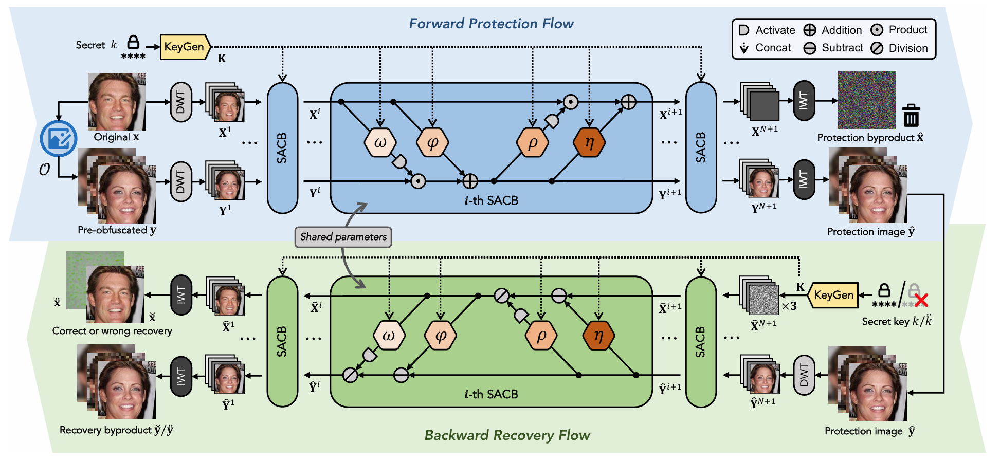

# Source Code for PRO-Face-S

Lin Yuan, Kai Liang, Xiao Pu, Yan Zhang, Jiaxu Leng, Tao Wu, Nannan Wang, Xinbo Gao. Invertible Image Obfuscation for Facial Privacy Protection via Secure Flow. IEEE Transactions on Circuits and Systems for Video Technology. Volume: 34, Issue: 7, July 2024，6077-6091. https://doi.org/10.1109/TCSVT.2023.3344809

**Abstract**. This paper presents a fresh paradigm for protecting facial privacy via an invertible image obfuscation framework that incorporates multiple characteristics including anonymity, diversity, reversibility, security, and lightweight all at once. We name the framework PRO-Face S, an acronym for Privacy-preserving Reversible Obfuscation of Face images via Secure flow. The core of the proposed framework is a flow-based generative model (or invertible neural network), which takes as input a face image along with its pre-obfuscated form, and outputs the privacy-protected image that visually mirrors the pre-obfuscated one. The pre-obfuscation applied can be in various forms with different types and strengths. The invertibility of the flow-based model ensures that the original image can be easily recovered from the protected image in high fidelity. An elaborate secret key mechanism is devised to securely guide the mutual transformations of privacy protection and image recovery, such that the correct recovery is only possible upon the availability of the correct secret, pre-specified by the user in the protection stage. Two modes of wrong recovery are investigated to deal with malicious recovery attempts in different scenarios. Finally, extensive experiments conducted on multiple image datasets demonstrate the superiority of the proposed framework over state-of-the-art methods.

An overview of our network architecture:

# Prepraration

### Dependencies

The project's runtime environment is based on Miniconda. You can use the following command to install the project's runtime environment：

``conda create --name PROFaceS --file requirements.txt``

### Face classification models
First, download the pretrained face classification checkpoints from any of the following links.
- [BaiduDisk link](https://pan.baidu.com/s/1q-s1G4aqSzcXEofDOEfeHg) (Password:`3cvh`)

Then, place the corresponding `.pth` model files under the `face/gender_model`.

### SimSwap models

To run SimSwap, you need to download its pretrained models from the following link:
- [BaiduDisk link](https://pan.baidu.com/s/1q-s1G4aqSzcXEofDOEfeHg) (Password:`3cvh`)

Then, place the file `arcface_checkpoint.tar` under `SwimSwap/arcface_model` and the three files `latest_net_*.pth` under `SwimSwap/models/checkpoints/people/`.

### FaceShifter models

To run FaceShifter, you need to download its pretrained models from the following link:
- [BaiduDisk link](https://pan.baidu.com/s/1q-s1G4aqSzcXEofDOEfeHg) (Password:`3cvh`)

Then, place the file `model_ir_se50.pth` under `FaceShifter/face_modules/` and file `G_latest.pth` under `FaceShifter/saved_models/`.

### Datasets
Our training was done is CelebA dateset, where all faces images were preprocessed to keep only the facial part. we have made our preprocessed CelebA dataset public. One many obtain the entire datasets (including the train/val/test splits and triplet files) from the following links:
- [BaiduDisk link](https://pan.baidu.com/share/init?surl=wMf-iRP5kVfeijvvZYOylQ) (Password: `dkhd`)
- [OneDrive](https://cqupteducn-my.sharepoint.com/:u:/g/personal/yuanlin_cqupt_edu_cn/EckcBzUQ-f1EgobKZGzJKPUB_g_SOxCXv5bF7e6Kx3O8Yw?e=wInwoU)

Then, place it in the directory specified by `dataset_dir` in the `config.py` file, or alternatively, modify the `dataset_dir` path to point to the location of the dataset

> At this stage, if you notice that any folders are missing, please manually create the required directories as outlined above.

# Training
Simply run `train_tcsvt.py` to start the training process.

# Testing
Simply run `test_tcsvt.py` to start the testing process. 

To perform testing, you need to download the test dataset and place it in the correct location. Below is the download link:
- [BaiduDisk link](https://pan.baidu.com/s/1vFbNzRYVM6Nr-0yTs8GrwA) (Password:`8pre`)

Then, after downloading, unzip the data and place it under the `experiments/` directory.

Then, place it in the directory specified by `dataset_dir` in the `config.py` file, or alternatively, modify the `dataset_dir` path to point to the location of the dataset

Additionally, for testing, you will need to provide a target image. Place the target image in the directory specified by `target_img_dir_test` in the `config.py` file, or alternatively, modify the `target_img_dir_test` path to point to the location of the target image.

# Trained model

You can download our trained model from this [BaiduDisk link](https://pan.baidu.com/s/1q-s1G4aqSzcXEofDOEfeHg) (Password:`3cvh`).

Then, place the file `hybridAll_inv3_recTypeRandom_secretAsNoise_TripMargin1.2_ep12_iter15000.pth` under `experiments/checkpoints_256/`.

# Acknowledgement

Please cite our paper via the following BibTex if you find it useful. Thanks. 

    @ARTICLE{10366303,
    author={Yuan, Lin and Liang, Kai and Pu, Xiao and Zhang, Yan and Leng, Jiaxu and Wu, Tao and Wang, Nannan and Gao, Xinbo},
    journal={IEEE Transactions on Circuits and Systems for Video Technology}, 
    title={Invertible Image Obfuscation for Facial Privacy Protection via Secure Flow}, 
    year={2024},
    volume={34},
    number={7},
    pages={6077-6091},
    keywords={Privacy;Face recognition;Security;Data privacy;Visualization;Information integrity;Information filtering;Privacy protection;face anonymization;image obfuscation;invertible;security},
    doi={10.1109/TCSVT.2023.3344809}
    }

If you have any question, please don't hesitate to contact us by ``yuanlin@cqupt.edu.cn``.